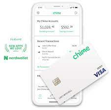

# Homework Week1 - FinTech Case Study

## overview and origin
* Chime (https://www.chime.com/). 

* Founded in 2013 in San Fracisco Bay Area, USA. By Chris Britt and Ryan King. Also, Publicy launched in 2014 on the Dr. Phil show when he surprised his guests with a **chime card** and $5,000.

> Their mission statement "We created chime because we beleive everyone deserves financial peace of mind. We're building a new kind of bank account that helps members get ahead by making managing money easy. It's your money, It's your life, Chime in.."

> Chris Britt, a Self-made billionair,  worked at VISA and prepaid card company Green Dot, before coofounding Chime with Ryan King in 2013. Both were living in the same San Francisco neighbourhood.The chat about banking and payments and the oppurtunities the space represented.They wanted to make an impact outside the silicon Vally bubble, they decided to make the changes to people's financial health and provide a financial peace of mind to the american consumer. Chime started as a mobile banking APP and debit card with no monthly fees. The company depended on third party payments platform, but as started to scale up the company adopted a strategy to insource all the components of its digital stack allowing eventually to control their destiny. During the pandmic, one of Chime's most popular features was a stimulate advance-it let the customers borrow $1,200 before their goverment check arrives.It took Chime one year to reach one million customer account, in 20019 they have 5 Million customer accout. 

> Chime raised $2.6B in funding over 10 rounds. The funding started on August 2013 through seed round with $3.8M by 3 investors and one partner investor. 2 Rounds of Series A funding in 2014 and 2016, followed by Series B round in 2017. The funding rounding continue as the company
proven sucess through series C, D, E and recently raised another $1.1B in a form of Late State Ventur or series G By August 13, 2021 which makes the total to $2.6B. In addition to funding, the company
acquiered startups to strengthen its cababilities and to extend its reach to the consumers in the personal finance domain. Pinch (https://www.pinchrent.com/) in 2018 and Charlie Finance (https://www.hicharlie.com/)in 2021.The company now has post-money valuation in the range of $10B according to (https://www.privco.com/)

## Business Activities

### What Problem?
> Chime built to solve problems that are customers face when dealing with traditional banks or trying to manage their money. Problems like Overdraft fees, Bank holds, maintenance fees and bank trust. The banking services should be simple, helpful and free. This was the premise that Chime founded upon, by solving the financial problems that every American face. With Chime, the customer can have a more healthy persoanl finance through the several services and solutions made available for the users.

### Who are Chime Users?
> All individuals that require banking services. Chime users are individuals with Fixed, and low income, unemployed and unbanked. The following are the number of customers Chime have and the growth presented over the years. As it provides more than just mobile banking experience to its customers. Chime competes with a “featurization” strategy. The fintech certainly offers a good mobile user experience and touts no fees to attract low- to middle-income consumers.While Chime has grown its overall customer base, the percentage of Gen Zers that consider Chime their primary checking account provider declined between October 2020 and July 2021 according to two Cornerstone Advisors consumer studies. Coming from 1 Million user in 2018, now thay have more than 12 Million user.

### Chime Features

>Chime is using so many advantages, onstage and backstage, to further leverage their offerings and improve their product attractiveness to the customers. The unfair advantage that Chime utilise to compete is the service of overdraft protection called **SpotMe**  and their early deposit system which allows customers to get their paycheck up to two days early. ... Chime's current success comes from its mobile friendly approach to banking that appeals to cash-strapped millennials. the other feature that Chime have and give them leverage on top of its competition is **Credit-builder credit card** Chime’s predominantly low- to middle-income consumers aren’t in the crosshairs of the big credit card issuers’ marketing efforts. According to Cornerstone, 15% of Chime’s primary banking customers either have the card or are on its wait list. To get the card, a customer must have a Chime Spending Account and have set up their direct deposit with Chime.

### Digital Stack of Chime 

> Chime uses 28 technology products and services including HTML5, Google Analytics, and jQuery, according to G2 Stack. and actively using 26 technologies for its website, according to BuiltWith. These include SPF, Domain Not Resolving, and Google Apps for Business. The company also has registered 3 trademarks with the most popular class being 'Insurance; financial affairs', according to IPqwery. Here is the list of technologies by Categoty :

- Analytics & BI : Optimizely, Google Anlytics, CrazyEgg, Flurry
- Application Maintenance : NewRelic
- CMS : WordPress
- Collaboration : Google Drive
- Demand Generation : Tapfiliate 
- Design : Fonts.Com, Adobe TypeKit
- Digital Marketing : Google Tag Manager
- eComemrce : UpSellit
- eMail Hosting and Tools : dmarican, ValiMail, G Suite
- eMail Marketing : Mailgun
- Hiring : GreenHouse, ZipRecruiter
- Hosting : nginx, Cloudflair, DNS Made Easy, Pantheon
- Languages and Framework : HTML5
- Marketing Automation : HubSpot Markting Hub, Segment
- Security : GlobalSign, reCAPTCHA, DigiCert
- Social Media : AddThis
- Software Development : MapBox, Google Maps 
- Support : Zendesk
- User Engagement : Apester

> Chime is actively using 26 technolgies for its website, according to builtWith (https://builtwith.com/detailed/chime.com) :
- Ads : Microsofit Advertising
- Anlaytics : Iterable
- CDN : Cloudflare
- CMS : Atlassian Cloud
- Framework : Ruby and Rails token, PHP, Java EE,Bug Bounty,GlobalSign Domain verification, Heroku Vigor proxy
- Hosting : Fastly hosted, Fastly load balancer, cloudflair hosting, Amazon, Domain Name Resolving
- Media : Zoom
- Mobile : Apple Mobile Web App Capable, Mobile Optimzed
- eMail hosting providers : Valimail, SPF, Google APPs for Business
- Name Server : Cloudflare DNS
- Server : IPv6
- SSL : DigiCert SSL
- Widgets : Zapier, Zoom, DocuSign, Okta  

> Chime has also patents and regisitered trademarks, In addition to CHIME :
- SPOTME : Debit account services featuring a computer readable card.

## Landscape

### What Domain of FinTech?

> Chime, operates in the FinTech Domain of Online Banking (Or Digital Banking), with products and services that include : Magnetically encoded debit cards; 
Downloadable computer application software for mobile phones, tablets, handheld computers and mobile devices, namely, software for accessing, viewing and managing checking accounts, credit card accounts and savings accounts, paying bills and transferring money; 
Downloadable software in the nature of a mobile application to allow users to search, identify, and redeem loyalty reward offers; E-commerce software to allow users to perform electronic banking services via a global computer network; 
Applications for mobile phones for accessing banking services and information ATM banking services; Banking services; Bill payment services; Checking account services; Credit and loan services; Financial services, namely, electronic remote check deposit services; Money transfer; 
online banking services; Savings account services; Debit account services featuring a computer readable card. Electronic banking via a global computer network;
online banking services accessible by means of downloadable mobile applications Design, development, installation and maintenance of computer software Research and development services in the field of technology and intellectual property rights relating to financial services, mobile banking through bank partners, and related products

### Trends of OnLine Banking
 
>Online Banking was first adopted in New York in 1981 where the major banks like Citibank, Chase and others provided home banking services by making use of a system called videotext. Stanford Federal Credit Union was the first service provider of internet banking in October 1994. The Digital Banking and FinTech in general have begun developing on a lrager scale after 2007 financial crisis, which caused a decline in confidence in traditional financial institutions. Since then, the sector has grown to be one of the most competitive industries, thanks to (but not limited to) new technologies that allowed many businesses to gain a competitive advantage: Blockchain, AI, biometric indication, RPA, big data, new payment methods, infrastructure-based technologies, and others.
Chime apply these cutting-edge technologies to improve existing financial services or create new ones, the following trends adopted by Chime, alongside by other digital banking providers:

- Growth of online transactions : people more often choose it over offline payments and trips to brick-and-mortar stores.Besides, during remote times, many have tried stock trading
- Simplified access to the banking products : 
- paperless documentation
- AI and ML usage
- Data-driven approach
- Greater personalisation
- Rise of neobanks
- Vivid design of mobile banks
- Cloud technologies

> the following table shows the growth of Chime as a result of adopting the customers trends in digital banking and online landscape in general:

| Year | Users      | Valuation |
| ---- | ---------- | --------- |
| 2018 | 1 Million  | $0.5B.    |
| 2019 | 5 Million  | $5.8B     |
| 2020 | 10 Million | $14.5B.   |
| 2021 | 12 Million | $25B.     |

### Other digital banking providers

- Sofi : Founded in 2011 based in San Francisco USA.
- Nubank : Founded in 2013 based in Sao Paulo, Brazail.
- Tinkoff : Founded in 2006 based in Moscow, Russia. 
- Money Lion : Founded in 2013, based in NY City, USA. 
- N26 : founded in 2013, based in Berlin, Germany. 
- Revolut : Founded in 2015, based in London, England. 

## Results

### Impact of chime

>chime is a an online bank that is attemting to change the way people think about money and aim to partner with customers to help them acheive their goals that ends with a mutual benifit. It does not profit of customers by charging fees, their revenue is coming by taking a percentage of the interchange fees that VISA  charges to the merchant. Their gools are 
- to have their customers use their chime debit card for purchase
- to ship debit cards quickly witin 1 day
- to reduce the time from application complete to the customer receiving their card
- to increase referral year over year 

### What to look at when measuring the success of a fintech business?

- Acquisition, including the number of app downloads and new customers,
- Activation, which indicates the number of people who actually start using your solution,
- Retention rate, which indicates how many people hold on to and keep on using your product,
- Number of referrals, or customer recommendations, is one of the best indicators of success you can look at,
- Daily revenue, and/or the number of transactions,
- Marketing metrics that best work for the business,
- Technical metrics, including page load times and database memory use that indicate how smoothly your tool performs.

> chime acquisition funnel is done through steps, Incoming traffic from various sources , APP searches, App downloads, New account applications, Chime debit card activiation, 1st Chime card swipe, and 50th chime debit card swipe.
> here is how chime is compared with the other rivals in the domain :

| Company | Number of Customers | Value   |
| ------- | ------------------- | ------- |
| Chime   | 12 Million          | $25B    |
| Sofi    | 7.5 Million.        | $9B.    |
| NuBank. | 35 Million.         | $25B.   |
| Tinkoff | 13 Million.         | $17B.   |
| N26.    | 7 Million.          | $3.5B.  |
| Revolut | 15 Million.         | $33B    |

### Chime Performance

>Just 8% of US consumers consider an online bank like Chime or Varo their primary bank (Observation made by FinTech Snark Tank). But among consumers with two accounts, digital banks have a 14% market share, and of Americans with three accounts, they’ve captured 17% of the pie. All told, consumers have 27 million accounts opened with online banks. Chime has a 35% share of all digital banks checking accounts. The next biggest competitors are Ally Bank with 9% of the digital banking market, and Varo Money with 6% share.Chime has done an amazing job at customer acquisition and dominates the digital bank space.  
But, there are 3 looming threats to the growth to Chime and other FinTech Companies: 
- Emerging niche digital banks : Chime and Varo have been battling it out for the low- to middle-income consumer segment in the digital banking space, but as players like First Boulevard, OurBanc, and Greenwood gain traction in the African-American community they’ll stunt Chime’s growth. Other niche neobanks will also chip away at both Chime’s existing and potential customer base. Translation: Chime’s hockey stick growth curve may be upside down.
- Wallmart : Low- to middle-income consumers comprise Walmart’s core customer base. The retailer’s existing financial service offerings clearly haven’t stunted Chime’s growth. The big unknown is what Walmart’s fintech plans are. My hypothesis is that Walmart wants to build a super app that would bundle a wide range of services, not just retail and financial. If Chime’s plan is to expand beyond financial products (like Revolut with its travel agency), it better get a move on if it hasn’t done so already.
- Square : From a demographic perspective, Square Cash App users look a lot like Chime’s customers. With its seller ecosystem services, Square Capital, and now a business checking account, Square has created a business model that goes well beyond just making money on interchange. With its crypto services and the acquisition of Tidal, Square has diversified its revenue sources from its consumer base.

## Recommendations

* If you were to advise the company, what products or services would you suggest they offer? 
* Why do you think that offering that this product or service would benefit the company?
* What technologies would this product or service utilize
* Why are there tecnologies appropoeriate for your solution

## Sources
- crunchbase (https://www.crunchbase.com/organization/chime-2)
- Medium (https://medium.com/life-at-chime/its-a-chimed-life-meet-ryan-king-our-co-founder-and-cto-7a1eab890e53)
- BusinessOfApps (https://www.businessofapps.com/data/chime-statistics/)
- Softensy (https://softensy.com/current-digital-banking-trends-do-you-still-need-a-web-based-app-in-2021/)
- BuiltWith (https://builtwith.com/detailed/chime.com)
- Forbes (https://www.forbes.com/profile/chris-britt/?sh=7a907bd47277)
- Gartner (https://wwww.gartner.com)
- Netguru (https://www.netguru.com/blog/success-in-the-fintech-world)
- Yahoo Finance (https://finance.yahoo.com/news/fintech-analytics-top-7-metrics-182104952.html?guccounter=1)
- Builtin (https://builtin.com/fintech/fintech-companies-startups-to-know)
- eMarketer (https://www.emarketer.com/content/chime-no-1-neobank-us)
- FinTech Magazine (https://fintechmagazine.com/
- topmobilebanks.com (https://topmobilebanks.com/blog/biggest-digital-banks-2021/)
- Slideshare (https://www.slideshare.net/BryantOwens/chime-product-breakdown-final-219595468)

